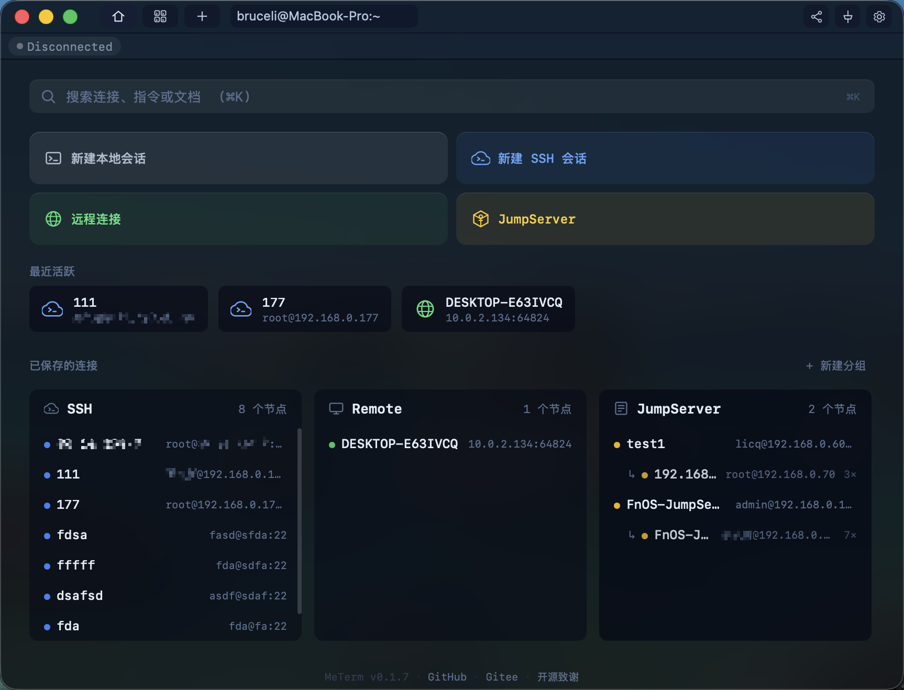
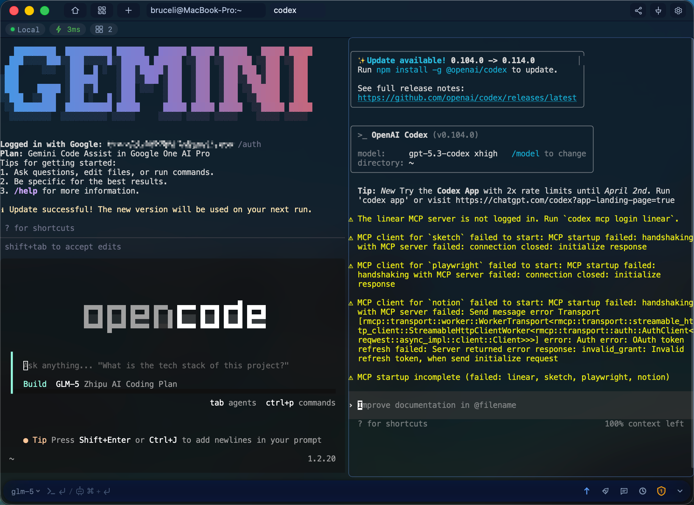
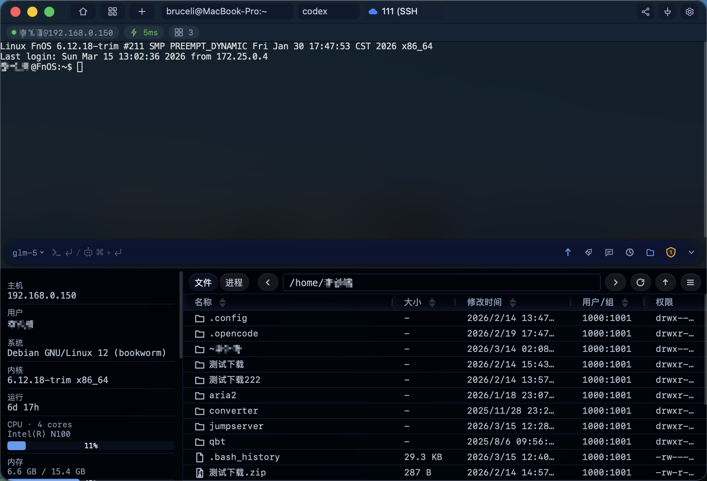
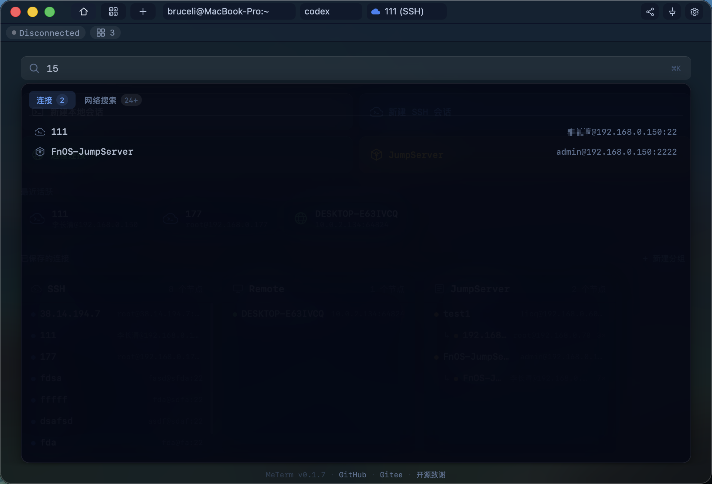
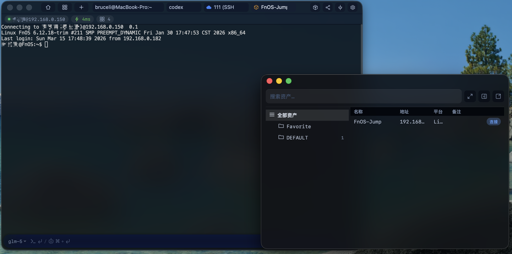
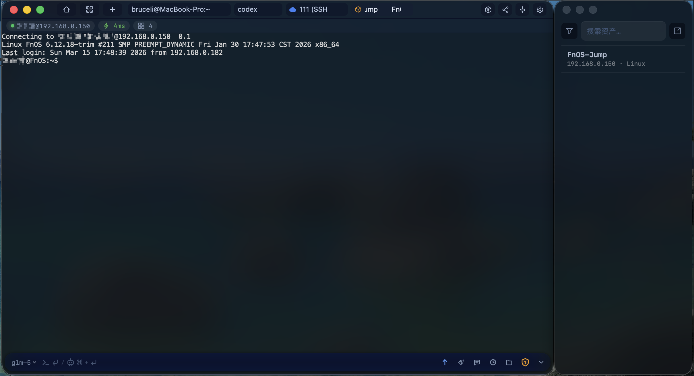
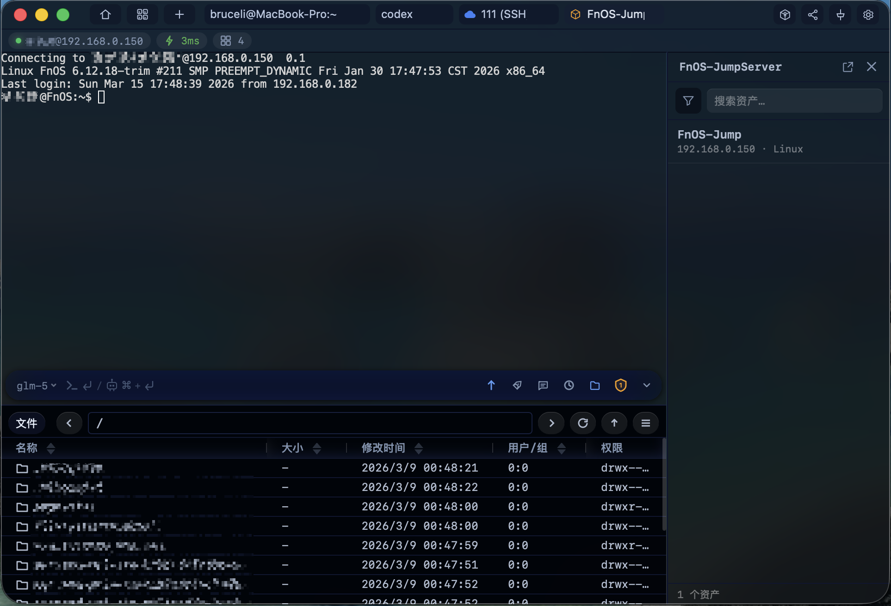
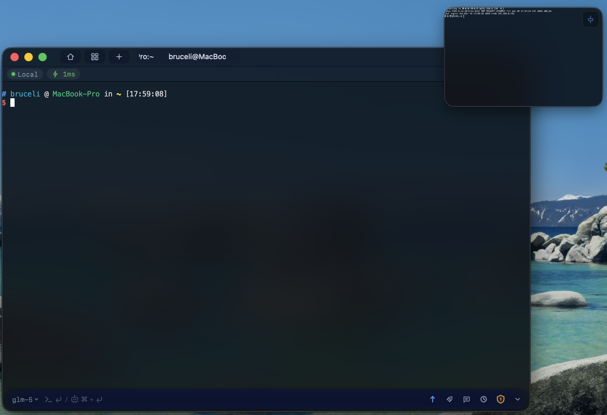
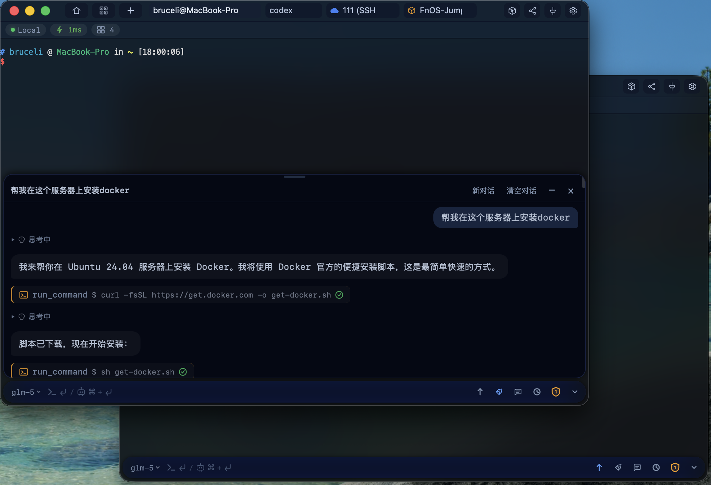
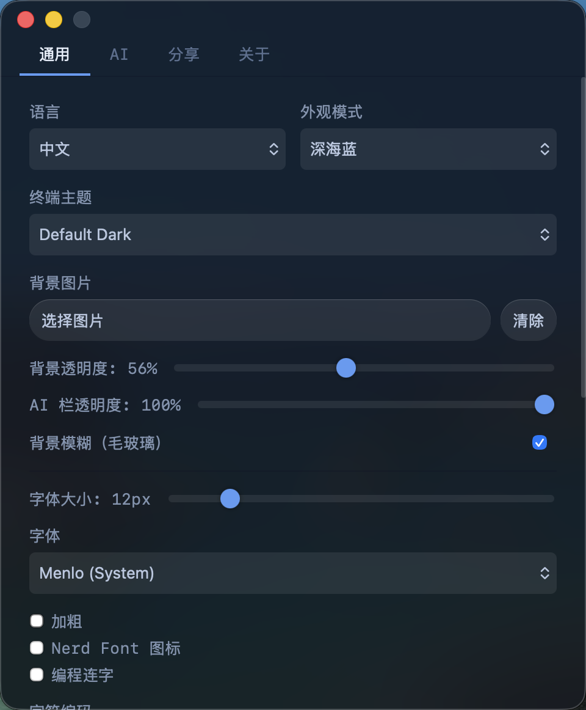

<div align="center">


# MeTerm

**Multi-client shared terminal session system — Real-time terminal collaboration**

[](https://github.com/paidaxingyo666/MeTerm/actions/workflows/build-macos.yml)
[](https://github.com/paidaxingyo666/MeTerm/actions/workflows/build-windows.yml)
[](LICENSE)
[](https://github.com/paidaxingyo666/MeTerm/releases/latest)
[](https://github.com/paidaxingyo666/MeTerm/releases)

[中文](./README_CN.md) · [Download](#download) · [Quick Start](#quick-start) · [Docs](#documentation) · [Acknowledgements](#acknowledgements)

</div>

---

## Screenshots

| Terminal | Split Pane |
|:---:|:---:|
|  |  |

| SFTP File Manager | Home Search |
|:---:|:---:|
|  |  |

| JumpServer Asset Browser | JumpServer Terminal | JumpServer File Manager |
|:---:|:---:|:---:|
|  |  |  |

| Picture-in-Picture |
|:---:|
|  |

| AI Assistant | Settings |
|:---:|:---:|
|  |  |

---

## Key Features

**Four session types:**

- **Local Terminal** — Out-of-the-box local shell sessions
- **SSH Remote** — Password/key authentication to remote servers
- **JumpServer** — Browse and connect bastion host assets (tested v2 & v4, supports MFA authentication)
- **Remote Sharing** — Join shared sessions on other MeTerm devices in the LAN

**Tab management:**

- Multi-tab with drag-to-reorder, drag tab out to create new window
- Split pane layout (horizontal/vertical, independent sessions per pane)
- Picture-in-Picture (PiP) floating window

**Terminal enhancements:**

- AI Assistant Capsule — Floating dialog, supports OpenAI-compatible / Anthropic / Gemini protocols, connect any LLM
- SFTP File Manager — Upload/download/resume/drag-and-drop/queue/remote file editing
- Command completion & tldr help cards
- Home quick search — Local commands + web search (requires self-hosted [SearXNG](https://github.com/searxng/searxng))
- Backgrounds & Themes — 8 terminal themes, 5 color schemes
- Session recording & replay

**Collaboration & networking:**

- Multi-client sharing — Multiple users on the same terminal in real-time
- Role-based access control — Master / Viewer / ReadOnly with role transfer
- mDNS service discovery — Auto-discover devices on LAN
- Auto-reconnection — Ring buffer for missed data

**Other:**

- Windows right-click menu integration (Open in MeTerm)
- Clickable file paths in terminal output (open files/folders directly)
- Auto updates · Internationalization (EN/ZH) · Desktop notifications

---

## Platform Support

| Platform | Architecture | Status |
|----------|-------------|--------|
| macOS | Apple Silicon (arm64) | ✅ Supported |
| macOS | Intel (x86_64) | ✅ Supported |
| Windows | x64 | ✅ Supported |
| Linux | x64 | 🚧 Planned |

---

## Download

<p align="center">
  <a href="https://github.com/paidaxingyo666/MeTerm/releases/latest"></a>
  &nbsp;&nbsp;
  <a href="https://github.com/paidaxingyo666/MeTerm/releases/latest"></a>
</p>

| Platform | Installer |
|----------|-----------|
| macOS (Apple Silicon) | `MeTerm_x.x.x_aarch64.dmg` |
| macOS (Intel) | `MeTerm_x.x.x_x64.dmg` |
| Windows (x64) | `MeTerm_x.x.x_x64-setup.exe` |

> [!WARNING]
> **macOS**: The app is not Apple-signed. macOS may report it as "damaged" or "unverified developer". Run this command in Terminal, then reopen the app:
>
> ```bash
> sudo xattr -rd com.apple.quarantine /Applications/MeTerm.app
> ```

---

## Quick Start

### Prerequisites

| Dependency | Version | Installation |
|------------|---------|-------------|
| **Node.js** | 20+ | [nodejs.org](https://nodejs.org/) or `brew install node` |
| **Rust** | latest stable | `curl --proto '=https' --tlsv1.2 -sSf https://sh.rustup.rs \| sh` |
| **Make** | — | macOS built-in; Linux: `sudo apt install build-essential` |

### Development Setup

```bash
# Clone the repository
git clone https://github.com/paidaxingyo666/MeTerm.git
cd MeTerm

# Install desktop frontend dependencies
cd desktop && npm install && cd ..

# Start desktop app in dev mode
make desktop-dev
```

Windows development (from WSL):

```bash
make desktop-dev-win              # Start dev
```

<details>
<summary><b>Build Installers</b></summary>

#### macOS

```bash
make release-macos                # Current architecture
make release-macos-arm64          # Apple Silicon
make release-macos-x86_64         # Intel
make release-macos-all            # Build both architectures

# Code signing (requires Apple Developer ID)
./build-macos.sh --arch arm64 --sign
```

#### Windows

```bash
make desktop-build-win            # One-click build from WSL
```

#### Generic

```bash
make desktop-build                # Tauri production build (current platform)
```

</details>

---

## Architecture

Since v0.2.0, MeTerm has migrated from a Go sidecar architecture to a **pure Rust in-process backend**, eliminating external process management and inter-process communication overhead.

```text
MeTerm/
├── desktop/              # Tauri v2 desktop app
│   ├── src/              #   Frontend TypeScript (90+ modules)
│   │   ├── ai-capsule*   #     AI assistant (floating dialog, tools, agent)
│   │   ├── file-manager  #     SFTP file manager
│   │   ├── session       #     Session management (Tauri IPC)
│   │   ├── terminal-*    #     Terminal instances (local/remote)
│   │   ├── split-pane    #     Split pane layout
│   │   └── ...
│   └── src-tauri/        #   Rust backend
│       └── src/
│           ├── commands/  #     Tauri IPC commands (session, window, menu, AI, etc.)
│           └── server/    #     In-process HTTP/WebSocket server
│               ├── session/    # Session state machine & manager
│               ├── terminal/   # Cross-platform PTY (Unix/Windows/WSL/SSH)
│               ├── executor/   # Local & SSH executors
│               ├── jumpserver/ # JumpServer asset browser
│               ├── dispatch    # Binary protocol message routing
│               ├── file_handler# File transfer (SFTP adaptive pipeline)
│               ├── auth        # Bearer token authentication
│               ├── discover    # mDNS service discovery
│               └── ...
├── frontend/             # Standalone web frontend (xterm.js + Vite)
├── cloudflare-worker/    # CF Worker auto-update service
└── scripts/              # Build helper scripts
```

## Tech Stack

| Layer | Technologies |
|-------|-------------|
| **Backend** | Rust, Axum, Tokio, xpty (cross-platform PTY), russh (SSH/SFTP), mdns-sd |
| **Frontend** | TypeScript, Vite, xterm.js 5.x, CodeMirror 6 |
| **Desktop** | Tauri v2 (Rust + TypeScript), reqwest, keyring, rusqlite |
| **Update** | Tauri Updater + Cloudflare Worker |

### Architecture Highlights

- **Single-process** — Backend server runs in-process via Tokio, no external sidecar management
- **Cross-platform PTY** — Unified abstraction over Unix PTY, Windows ConPTY, WSL, and SSH
- **Session state machine** — Created → Running → Draining (with ring buffer) → Closed, supporting seamless reconnection
- **Binary protocol** — Custom binary messaging over WebSocket for efficient terminal I/O
- **Adaptive SFTP pipeline** — Dynamic window scaling (2→64) based on RTT for high-throughput file transfers

---

## Documentation

| Document | Description |
|----------|-------------|
| [REST API Reference](docs/API.md) | Complete API endpoints and usage examples |
| [Binary Protocol](docs/PROTOCOL.md) | WebSocket binary communication protocol spec |
| [Configuration](docs/CONFIGURATION.md) | Server parameters, client settings, role system |
| [Session Recording](docs/RECORDING.md) | Recording format and playback |

---

## Contributing

Issues and Pull Requests are welcome!

1. Fork the repository
2. Create a feature branch (`git checkout -b feature/amazing-feature`)
3. Commit your changes (`git commit -m 'Add amazing feature'`)
4. Push the branch (`git push origin feature/amazing-feature`)
5. Open a Pull Request

---

## Acknowledgements

MeTerm is built on top of many excellent open-source projects. Thanks to all contributors!

See [THIRD_PARTY_LICENSES.md](THIRD_PARTY_LICENSES.md) for full third-party license details.

---

## License

[MIT License](LICENSE)
