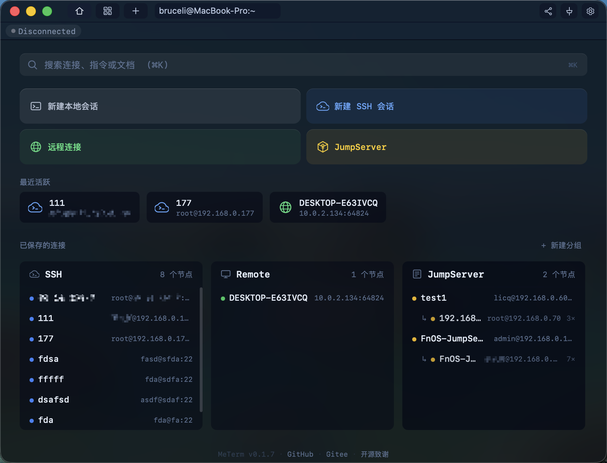
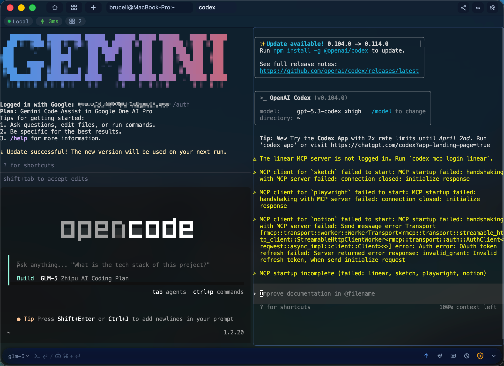
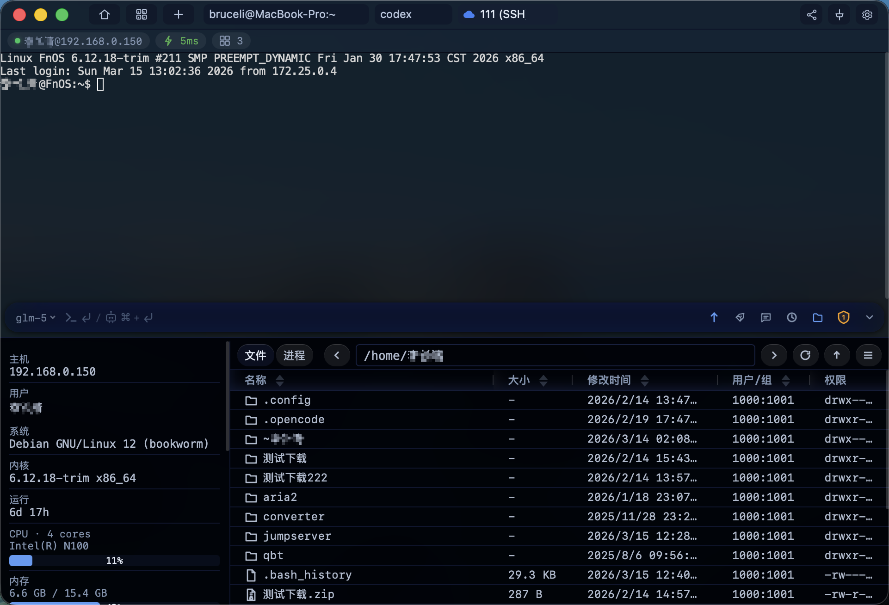
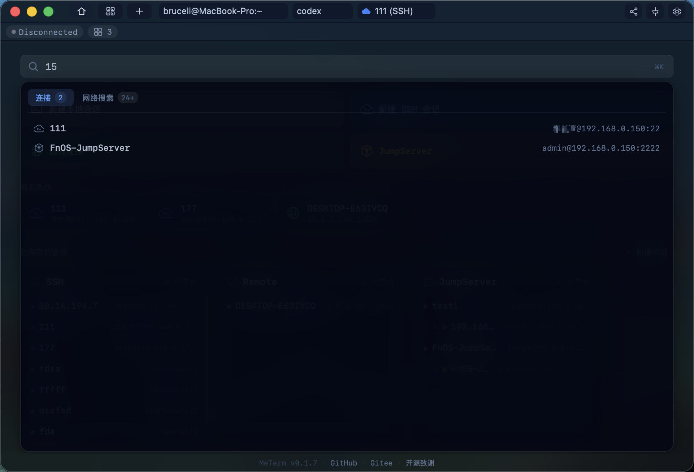
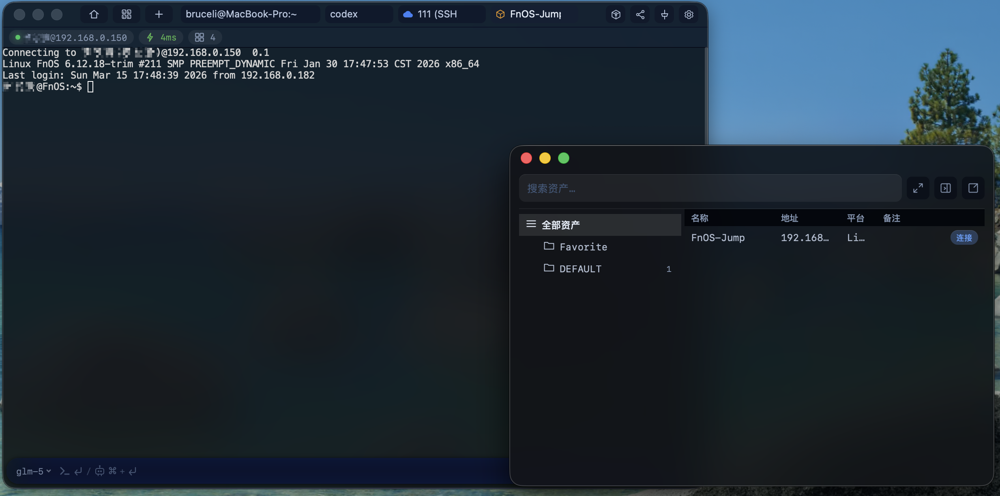
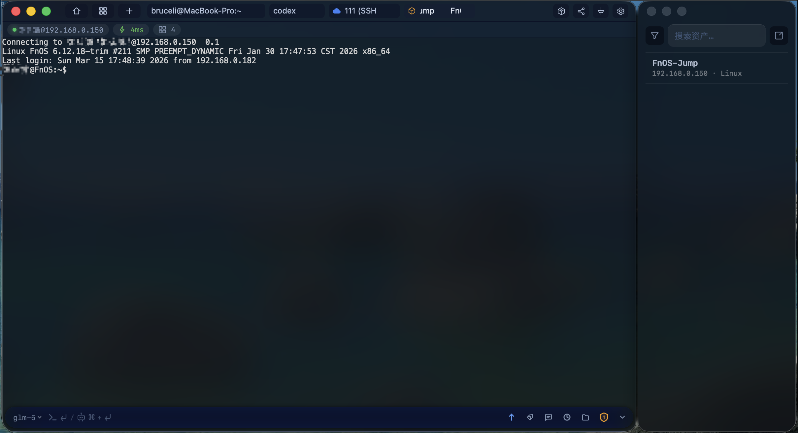
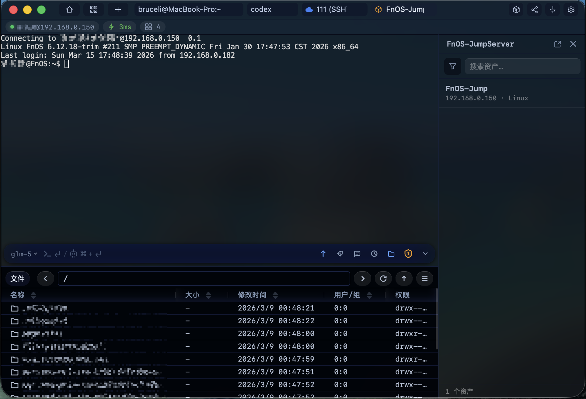
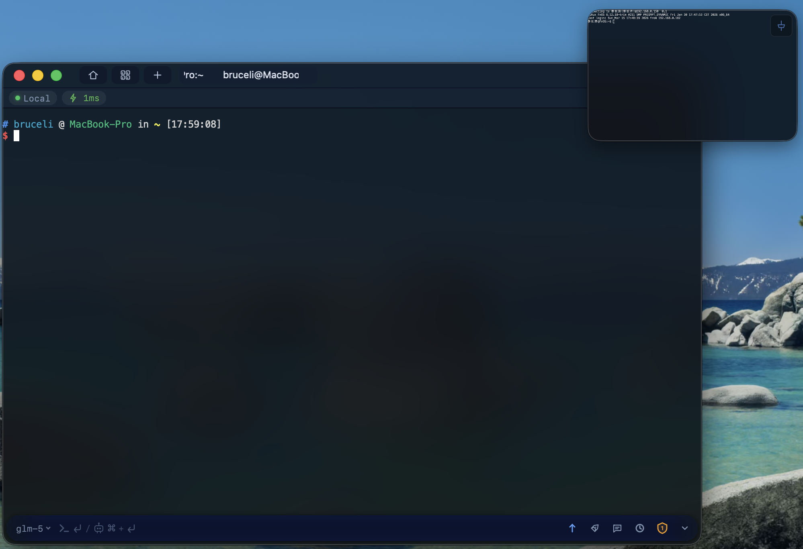
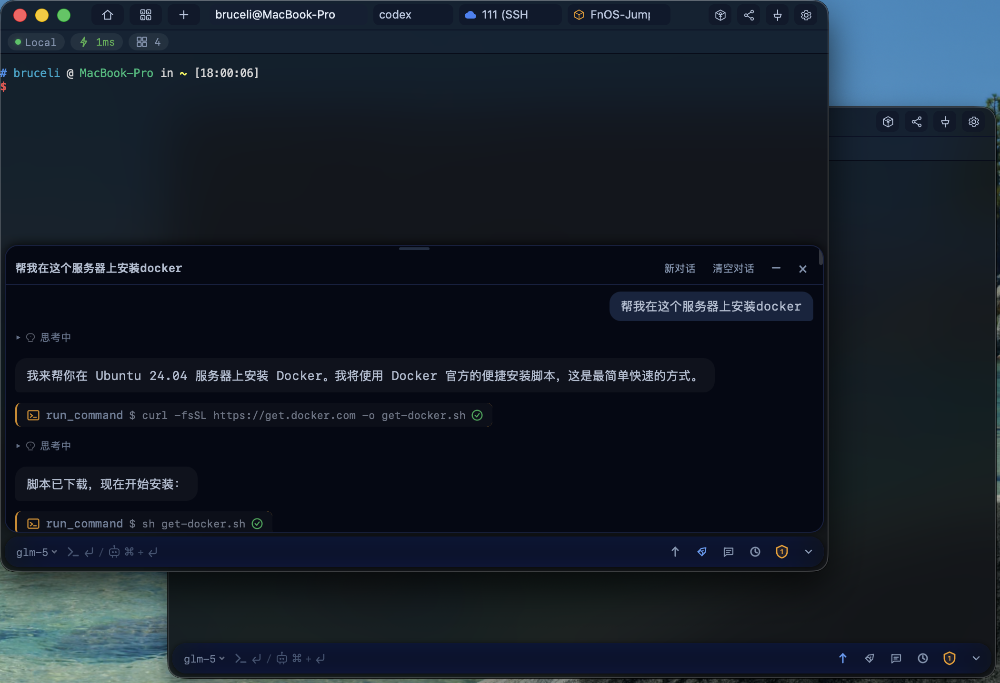
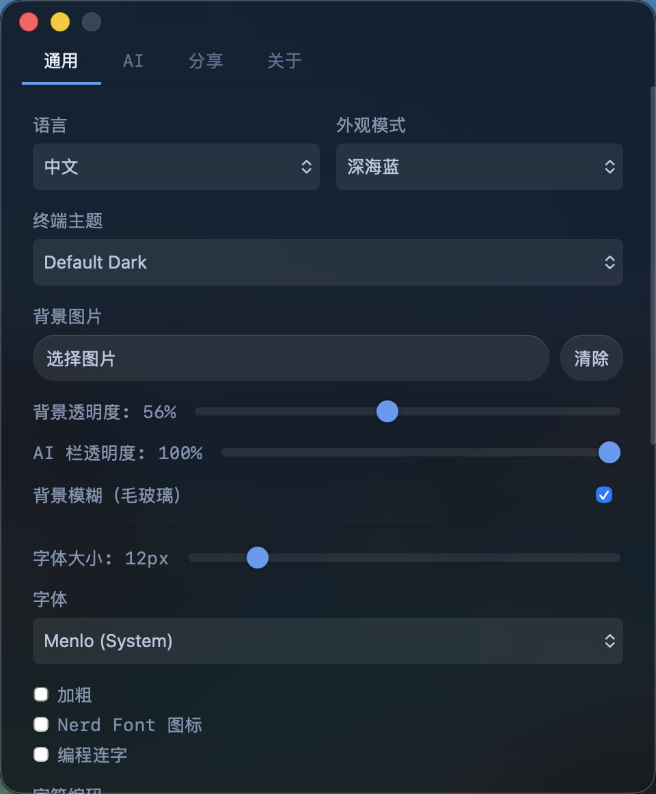

<div align="center">


# MeTerm

**多端共享终端会话系统 — 让多人实时协作同一个终端**

[](https://github.com/paidaxingyo666/MeTerm/actions/workflows/build-macos.yml)
[](https://github.com/paidaxingyo666/MeTerm/actions/workflows/build-windows.yml)
[](https://github.com/paidaxingyo666/MeTerm/actions/workflows/build-linux.yml)
[](LICENSE)
[](https://github.com/paidaxingyo666/MeTerm/releases/latest)
[](https://github.com/paidaxingyo666/MeTerm/releases)

[English](./README.md) · [下载安装](#下载安装) · [快速开始](#快速开始) · [文档](#文档) · [开源致谢](#开源致谢)

</div>

---

## 截图预览

| 终端主界面 | 分屏布局 |
|:---:|:---:|
|  |  |

| SFTP 文件管理 | 主页搜索 |
|:---:|:---:|
|  |  |

| JumpServer 资产浏览 | JumpServer 终端 | JumpServer 文件管理 |
|:---:|:---:|:---:|
|  |  |  |

| 画中画 |
|:---:|
|  |

| AI 助手 | 设置面板 |
|:---:|:---:|
|  |  |

---

## 核心特性

**四种会话类型：**

- **本地终端** — 开箱即用的本地 Shell 会话
- **SSH 远程连接** — 密码/密钥认证，连接远程服务器
- **JumpServer 堡垒机** — 浏览并连接堡垒机资产（已测试 v2 与 v4，支持 MFA 认证）
- **远程共享** — 连接局域网内其他 MeTerm 设备，加入共享会话

**标签页管理：**

- 多标签页，拖拽排序，拖出标签创建新窗口
- 分屏布局（水平/竖直分割，各分屏独立会话）
- 画中画（PiP）浮动窗口

**终端增强：**

- AI 助手 & Agent — 浮动对话面板或侧栏模式，支持 OpenAI 兼容 / Anthropic / Gemini 三种协议；Agent 模式新增多面板感知、文件传输、任务规划、结构化搜索和会话 PTY 锁
- SFTP 文件管理 — 面包屑导航、键盘导航、文件搜索、多选操作、远程复制/移动、chmod 权限修改、书签收藏、限速控制、传输通知、拖拽上传、断点续传、SFTP 自适应流水线高速并行传输
- 内置编辑器 — 远程文件直接编辑、Markdown 渲染预览、图片预览、自动换行、多格式化支持（JSON/XML/HTML/CSS）
- Shell Hook 注入 — 基于 OSC 7766/7768 语义提示符：点击移动光标、拖拽选中编辑命令区；无 Hook 时自动回退
- 命令补全 & tldr 帮助卡片
- 主页快速搜索 — 本地命令 + Web 搜索（需自建 [SearXNG](https://github.com/searxng/searxng) 实例）
- 主题 & 背景 — 8 个终端主题、Neo-Brutalism 主题（标准版 + 圆角变体，11 套预设：赛博朋克 / 深渊 / 薰衣草 / 午夜 / 糖果 / 复古 / 极光 / 德古拉 / 曝光 / 纯黑系列 + 自定义调色板，支持跨窗口实时同步）
- 终端字体增强 — 字重控制、文字锐化、字体大小快捷键（Ctrl/Cmd +/-）
- 会话录制回放

**协作与网络：**

- 多客户端共享 — 多人实时连接同一终端
- 角色权限控制 — Master / Viewer / ReadOnly，支持权限转移
- mDNS/Bonjour 服务发现 — macOS 使用系统 Bonjour 发布，Windows/Linux 使用跨平台实现
- 断线自动重连 — 环形缓冲区补发丢失数据

**其他：**

- Windows 右键菜单集成（在 MeTerm 中打开）
- 终端内文件路径可点击（直接打开文件/文件夹）
- SSH 代理支持 — SOCKS5 / HTTP CONNECT，JumpServer 可独立配置代理
- OSC 增强 — OSC 52 剪贴板穿透、OSC 8 超链接、图片显示协议
- Chrome 风格标签切换快捷键（Ctrl/Cmd 1-9）
- 窗口置顶按钮
- 启动时自动新建本地会话（可选）
- 自动更新 · 国际化（中/英） · 桌面通知

---

## 平台支持

| 平台 | 架构 | 状态 |
|------|------|------|
| macOS | Apple Silicon (arm64) | ✅ 已支持 |
| macOS | Intel (x86_64) | ✅ 已支持 |
| Windows | x64 | ✅ 已支持 |
| Linux | x64 (amd64) | ✅ 已支持（仅测试 Ubuntu 24.04） |
| Linux | arm64 | ✅ 已支持（仅测试 Ubuntu 24.04） |

---

## 下载安装

<p align="center">
  <a href="https://github.com/paidaxingyo666/MeTerm/releases/latest"></a>
  &nbsp;&nbsp;
  <a href="https://github.com/paidaxingyo666/MeTerm/releases/latest"></a>
  &nbsp;&nbsp;
  <a href="https://github.com/paidaxingyo666/MeTerm/releases/latest"></a>
</p>

| 平台 | 安装包 |
|------|--------|
| macOS (Apple Silicon) | `MeTerm_x.x.x_aarch64.dmg` |
| macOS (Intel) | `MeTerm_x.x.x_x64.dmg` |
| Windows (x64) | `MeTerm_x.x.x_x64-setup.exe` |
| Linux (amd64) | `.deb` / `.AppImage` / `.rpm` |
| Linux (arm64) | `.deb` / `.AppImage` / `.rpm` |

> [!NOTE]
> **Linux**：目前仅在 **Ubuntu 24.04** 上测试通过，其他发行版暂未测试，欢迎反馈问题。

> [!NOTE]
> **macOS**：公开的 v0.2.11 构建已完成 Developer ID 签名、公证和装订。此后的每个待发布候选仍须
> 独立通过 `docs/RELEASE_CHECKLIST.md` 中的签名、公证及 Keychain 升级验证；本地未签名开发构建
> 不能作为发布包。

---

## 快速开始

### 环境要求

| 依赖 | 版本 | 安装方式 |
|------|------|----------|
| **Node.js** | 20+ | [nodejs.org](https://nodejs.org/) 或 `brew install node` |
| **Rust** | latest stable | `curl --proto '=https' --tlsv1.2 -sSf https://sh.rustup.rs \| sh` |
| **Make** | — | macOS 自带；Linux: `sudo apt install build-essential` |

### 启动开发环境

```bash
# 克隆项目
git clone https://github.com/paidaxingyo666/MeTerm.git
cd MeTerm

# 安装桌面端前端依赖
cd desktop && npm install && cd ..

# 启动桌面应用开发模式
make desktop-dev
```

在 macOS 上验证手机完整远控或中继时，不要使用未签名的热更新可执行文件，
应运行隔离且经过 Apple Development 签名的开发包：

```bash
make desktop-run-dev              # 构建、签名并打开 MeTerm Dev.app（com.meterm.dev）
```

该目标不会打开或覆盖已安装的正式版 `MeTerm.app`。后续重建需保持同一签名身份，
以确保开发 Keychain 的访问要求仍与应用匹配。

只有 `desktop-build-dev` 会同时启用 `development-mobile-control` 与
`development-credential-recovery`。Release 构建会拒绝该恢复 feature；导入命令执行前还会
校验当前运行的确实是指定签名身份的 `MeTerm Dev.app`。

`MeTerm Dev` 启动时绝不会扫描正式版 Keychain。开发凭据缺失时，只能在对应 SSH 保存连接的
右键菜单中主动选择开发专用导入；原生本机身份确认只展示这一条连接的精确 authority。
若 macOS 显示钥匙串弹窗，只选择“允许”，绝不要选择“始终允许”。该入口只允许读取已经隔离待处置的
正式 `com.meterm.app.ssh.v2` 条目，绝不读取新的正式 v3 库；已绑定的 v2 凭据必须与 authority
完全匹配，旧版未绑定 v2 只会在本次明确身份确认后绑定到提示中展示的 authority。副本写入
隔离的开发 service；取消或失败后不会在下次启动自动重试，开发版正常运行也不会回退读取
正式凭据库。桌面私钥文件路径不会从 v2 复制，必须在本机重新选择，以便系统身份确认展示规范化后的
实际路径；ssh-agent/默认私钥授权不读取生产密钥字节，只在 owner confirmation 后写入新的 authority
marker。

旧 localStorage/name-keyed SSH、Remote、JumpServer 与设置凭据也不会在普通启动时自动打开钥匙串；
启动只检查 Web Storage，并记录脱敏的 pending/manual/complete 状态或非敏感 presence cache。
需要时请在对应连接/设置界面重新保存；正式、经本机身份确认的 recovery UI 落地前，不宣称分发包
能够恢复这些旧凭据。

Windows 开发（从 WSL 执行）：

```bash
make desktop-dev-win              # 启动开发
```

<details>
<summary><b>构建安装包</b></summary>

#### macOS

```bash
make release-macos                # 当前架构
make release-macos-arm64          # Apple Silicon
make release-macos-x86_64         # Intel
make release-macos-all            # 同时构建两个架构

# 使用本机 Keychain 里的 Developer ID 签名，不会导出私钥
APPLE_SIGNING_IDENTITY='Developer ID Application: …' \
  ./build-macos.sh --arch arm64 --sign

# 公证还需设置 APPLE_API_KEY_ID、APPLE_API_ISSUER_ID，以及指向本机
# App Store Connect .p8 文件的 APPLE_API_KEY_PATH
APPLE_SIGNING_IDENTITY='Developer ID Application: …' \
  ./build-macos.sh --arch arm64 --sign --notarize
```

#### Windows

```bash
make desktop-build-win            # 从 WSL 一键构建
```

#### 通用

```bash
make desktop-build                # Tauri 生产构建（当前平台）
```

</details>

---

## 架构概览

从 v0.2.0 起，MeTerm 已从 Go sidecar 架构迁移到**纯 Rust 进程内后端**，消除了外部进程管理和进程间通信的开销。

```text
MeTerm/
├── desktop/              # Tauri v2 桌面应用
│   ├── src/              #   前端 TypeScript（90+ 模块）
│   │   ├── ai-capsule*   #     AI 助手（浮动对话、工具、代理）
│   │   ├── file-manager  #     SFTP 文件管理器
│   │   ├── session       #     会话管理（Tauri IPC）
│   │   ├── terminal-*    #     终端实例（本地/远程）
│   │   ├── split-pane    #     分屏布局
│   │   └── ...
│   └── src-tauri/        #   Rust 后端
│       └── src/
│           ├── commands/  #     Tauri IPC 命令（会话、窗口、菜单、AI 等）
│           └── server/    #     进程内 HTTP/WebSocket 服务
│               ├── session/    # 会话状态机与管理器
│               ├── terminal/   # 跨平台 PTY（Unix/Windows/WSL/SSH）
│               ├── executor/   # 本地与 SSH 执行器
│               ├── jumpserver/ # JumpServer 资产浏览
│               ├── dispatch    # 二进制协议消息路由
│               ├── file_handler# 文件传输（SFTP 自适应流水线）
│               ├── auth        # Bearer token 认证
│               ├── discover    # mDNS 服务发现
│               └── ...
├── frontend/             # 独立 Web 前端（xterm.js + Vite）
├── control-broker/       # 独立、失败关闭的控制面协议核心（正式 scope 仍阻断）
├── cloudflare-worker/    # CF Worker 自动更新服务
└── scripts/              # 构建辅助脚本
```

## 技术栈

| 层级 | 技术 |
|------|------|
| **后端** | Rust, Axum, Tokio, xpty（跨平台 PTY）, russh（SSH/SFTP 终端链路）, ssh2/libssh2（桌面端 SSH 文件传输）, mdns-sd |
| **前端** | TypeScript, Vite, xterm.js 5.x, CodeMirror 6 |
| **桌面** | Tauri v2 (Rust + TypeScript), reqwest, keyring, rusqlite |
| **控制 Broker** | 独立 Rust 进程/协议核心；三平台系统服务适配尚未达到分发条件 |
| **更新** | Tauri Updater + Cloudflare Worker |

### 架构亮点

- **单进程架构** — 后端服务通过 Tokio 在进程内运行，无需管理外部 sidecar 进程
- **跨平台 PTY** — 统一抽象 Unix PTY、Windows ConPTY、WSL 和 SSH 终端
- **会话状态机** — Created → Running → Draining（环形缓冲区保存输出）→ Closed，支持无缝重连
- **二进制协议** — WebSocket 上的自定义二进制消息传输，高效终端 I/O
- **SFTP 自适应流水线** — 基于 RTT 动态窗口调整（2→64），实现高吞吐文件传输
- **桌面端 SSH 传输后端** — 桌面 SSH 上传和下载可走独立原生 SSH 传输路径，避免终端链路上的传输瓶颈

---

## 文档

| 文档 | 说明 |
|------|------|
| [REST API 参考](docs/API.md) | 完整的 API 接口列表和使用示例 |
| [二进制协议](docs/PROTOCOL.md) | WebSocket 二进制通信协议规范 |
| [配置参考](docs/CONFIGURATION.md) | 服务端参数、客户端设置、角色系统 |
| [会话录制](docs/RECORDING.md) | 录制格式和回放说明 |

---

## 贡献

欢迎提交 Issue 和 Pull Request！

1. Fork 本仓库
2. 创建功能分支 (`git checkout -b feature/amazing-feature`)
3. 提交修改 (`git commit -m 'Add amazing feature'`)
4. 推送分支 (`git push origin feature/amazing-feature`)
5. 创建 Pull Request

---

## 开源致谢

MeTerm 的诞生离不开以下优秀的开源项目，感谢所有贡献者！

完整的第三方许可证信息请参阅 [THIRD_PARTY_LICENSES.md](THIRD_PARTY_LICENSES.md)。

---

## 许可证

[MIT License](LICENSE)
